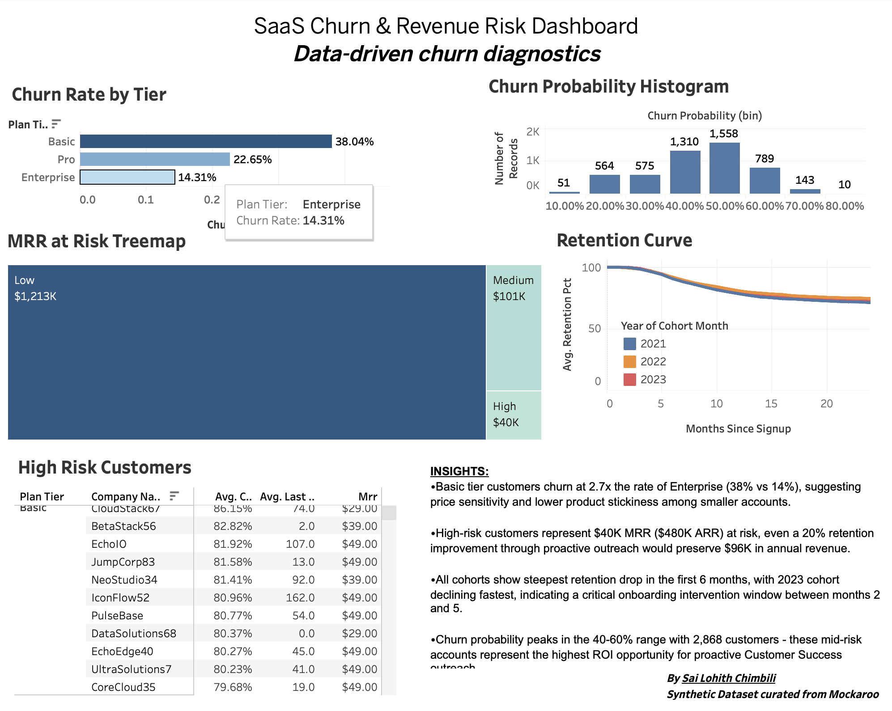

# SaaS Customer Churn Analytics & Revenue Intelligence

> **End-to-end churn analysis of 5,000 SaaS customers using PostgreSQL, Python, and Tableau — identifying $7.6K MRR ($91K ARR) at risk through predictive modeling, cohort analytics, and statistical hypothesis testing.**

---

## Overview

Customer churn is the silent revenue killer in every SaaS business. This project analyzes 5,000 SaaS customer records across three subscription tiers to identify churn drivers, quantify revenue at risk, and build a predictive model that flags high-risk accounts before they cancel.

The project simulates the full workflow of a data analyst at a SaaS company — from raw data extraction and SQL-based transformation, to statistical hypothesis testing, logistic regression modeling, and an executive-ready Tableau dashboard built for Customer Success and Revenue Operations teams.

---

## Key Findings

- **Basic tier customers churn at 2.7x the rate of Enterprise** (38.04% vs 14.31%), driven by higher support ticket volume and lower NPS scores
- **153 high-risk customers identified**, representing **$7,607 MRR ($91K ARR)** at risk — a 20% retention improvement through proactive outreach would preserve **$18.2K in annual revenue**
- **Support tickets confirmed as the strongest churn predictor** via Welch's t-test (t = 11.975, p < 0.001) — churned customers averaged 5.82 tickets vs 4.05 for retained customers
- **Churn rate differs significantly across plan tiers** (Chi² = 234.539, p < 0.001), validating tier-based segmentation as a meaningful retention strategy
- **Steepest retention drop occurs in months 2–5 post-signup** across all cohorts, identifying a critical onboarding intervention window
- Logistic regression model achieved **AUC = 0.665** with 67% recall on churn class — intentionally favoring recall to minimize missed at-risk accounts

---

## Dashboard

**[View Interactive Tableau Dashboard](https://public.tableau.com/views/SaasChurnRevenueRiskAnalytics/ExecutiveDashboard?:language=en-US&:sid=&:redirect=auth&:display_count=n&:origin=viz_share_link)** 



The dashboard is built for Customer Success and Revenue Operations leadership, answering three questions: Where is churn concentrated? How much revenue is at risk? Who needs to be contacted this week?

---

## Project Structure

```
saas-churn-analytics/
│
├── data/
│   └── saas_customers.csv               # Raw dataset (5,000 records, 11 fields)
│
├── sql/
│   ├── 01_schema.sql                    # PostgreSQL table creation
│   ├── 02_churn_rate_analysis.sql       # Monthly churn rate with rolling 3M average
│   ├── 03_revenue_at_risk.sql           # MRR at risk by plan tier with RANK()
│   └── 04_clv_by_cohort.sql             # Customer lifetime value by signup cohort
│
├── notebooks/
│   └── churn_model.ipynb                # Full EDA, hypothesis testing, and model
│
├── exports/
│   ├── saas_customer_scoring.csv        # Model output with churn probability + risk segment
│   └── saas_cohort_retention_curve.csv  # Cohort retention data for Tableau
│
├── tableau/
│   ├── Dashboard.png                    # Dashboard screenshot
│   └── saas.twb                         # Tableau workbook
│
├── .gitignore
└── README.md
```

---

## Methodology

### 1. Data Engineering
Generated a realistic SaaS customer dataset with fields mirroring actual CRM and billing system exports — plan tier, MRR, signup date, churn date, support tickets, NPS score, and login recency. Loaded into PostgreSQL, validated for completeness (5,000 records, 0 null values on key fields), and queried using production-style SQL before Python analysis.

### 2. SQL Analysis
Wrote complex queries using CTEs and window functions to calculate monthly churn rates with a 3-month rolling average, segment customers by revenue at risk, and compute cohort-level CLV. All queries are in the `/sql` directory and designed to run on any PostgreSQL instance.

### 3. Exploratory Data Analysis
Analyzed churn distribution across plan tiers, support ticket frequency, NPS score ranges, and login inactivity patterns. Confirmed that Basic tier had both the highest churn rate (38.04%) and the highest average support ticket count, while Enterprise customers had the strongest NPS scores and lowest churn.

### 4. Statistical Hypothesis Testing

**Welch's Independent T-Test — Support Tickets vs Churn**
- Tested whether churned customers submitted significantly more support tickets than retained customers
- Result: T-statistic = 11.975, p < 0.001
- Churned avg: 5.82 tickets | Retained avg: 4.05 tickets
- Conclusion: Statistically significant — support ticket volume is a reliable churn signal

**Chi-Square Test of Independence — Plan Tier vs Churn**
- Tested whether churn rate differs significantly across Basic, Pro, and Enterprise tiers
- Result: Chi² = 234.539, df = 2, p < 0.001
- Conclusion: Statistically significant — plan tier is a meaningful churn segmentation variable

Effect sizes were calculated alongside p-values to confirm practical, not just statistical, significance.

### 5. Predictive Modeling
Built a logistic regression classifier using four behavioral and contractual features: MRR, number of users, support tickets, and NPS score. Chose logistic regression intentionally over ensemble methods to maintain coefficient interpretability — each feature's impact can be explained directly to a non-technical stakeholder.

**Model performance on held-out test set (25%):**
- ROC AUC: 0.665
- Churn class recall: 0.67 (captures 2 in 3 actual churners)
- Churn class precision: 0.39
- Overall accuracy: 60%

The model was evaluated with `class_weight="balanced"` to account for class imbalance (71.3% retained vs 28.7% churned). Recall was prioritized over precision — in a real Customer Success workflow, the cost of missing a churner is higher than the cost of a false alarm.

**Feature importance (logistic regression coefficients):**
- Support tickets: +0.049 (strongest positive predictor of churn)
- NPS score: -0.007 (higher satisfaction = lower churn risk)
- MRR: -0.001 (higher contract value = lower churn risk)
- Num users: -0.001 (deeper product adoption = lower churn risk)

### 6. Risk Segmentation & Business Translation
Used percentile-based segmentation (qcut) to classify customers into Low (bottom 60%), Medium (60th–85th percentile), and High (top 15%) churn risk tiers. Customers flagged as High risk represent $7,607 MRR — the direct input to the Tableau High Risk Customers table.

### 7. Tableau Dashboard
Built a five-view interactive dashboard published to Tableau Public. Designed for a Customer Success audience with a clear action path: understand where churn is concentrated → quantify revenue exposure → identify which accounts to call this week.

---

## Statistical Results Summary

| Test | Statistic | P-Value | Conclusion |
|------|-----------|---------|------------|
| Welch's T-Test (Support Tickets) | t = 11.975 | p < 0.001 | Significant — support volume predicts churn |
| Chi-Square (Plan Tier vs Churn) | χ² = 234.539 | p < 0.001 | Significant — churn rate differs across tiers |

---

## Model Performance Summary

| Metric | Value |
|--------|-------|
| ROC AUC | 0.665 |
| Accuracy | 60% |
| Churn Recall | 67% |
| Churn Precision | 39% |
| High-risk customers flagged | 153 |
| MRR at risk | $7,607 |
| ARR at risk | $91,284 |

---

## What I Would Do With More Time

- Pull live subscription data from a Stripe sandbox API instead of a static CSV
- Add survival analysis (Kaplan-Meier curves) to estimate expected customer lifetime by segment
- Build an automated weekly Python script that re-scores all customers and emails a high-risk report to Customer Success
- Test XGBoost and compare AUC against logistic regression with proper cross-validation

---

## Author
**Sai Lohith Chimbili**
---

*Synthetic dataset generated via Mockaroo*
